# GitHub Release Workflow

## Workflow Diagram

```mermaid
flowchart TD
    Start([make github-release]) --> CheckSkipGit{SKIP_GIT=1?}
    
    CheckSkipGit -->|Yes| IncrementVersion[Increment Version]
    CheckSkipGit -->|No| GitStep1[Step 1: Check Git Status]
    
    GitStep1 --> HasUncommitted{Uncommitted<br/>changes?}
    HasUncommitted -->|Yes| AutoCommit[Auto-commit changes<br/>Prepare release: timestamp]
    HasUncommitted -->|No| GitStep2[Step 2: Push to Remote]
    AutoCommit --> GitStep2
    
    GitStep2 --> BranchExists{Branch exists<br/>on remote?}
    BranchExists -->|Yes| PushBranch[Push to origin/current-branch]
    BranchExists -->|No| CreatePushBranch[Create and push branch]
    PushBranch --> GitStep3[Step 3: Switch to develop]
    CreatePushBranch --> GitStep3
    
    GitStep3 --> OnDevelop{On develop<br/>branch?}
    OnDevelop -->|Yes| PullDevelop[Pull latest develop]
    OnDevelop -->|No| SwitchDevelop[Switch to develop branch<br/>Create if needed]
    PullDevelop --> GitStep4[Step 4: Wait for CI]
    SwitchDevelop --> GitStep4
    
    GitStep4 --> CheckGH[Check GitHub CLI<br/>gh auth status]
    CheckGH --> FindCI[Find latest CI run<br/>on develop branch]
    FindCI --> WaitCI[Watch CI run<br/>gh run watch]
    WaitCI --> CIFailed{CI<br/>passed?}
    CIFailed -->|No| ExitCI[Exit: CI failed]
    CIFailed -->|Yes| IncrementVersion
    
    IncrementVersion --> IncrementPatch[Increment patch version<br/>in VERSION file<br/>e.g. 1.0.74 → 1.0.75]
    IncrementPatch --> CleanRelease[Clean release directory]
    
    CleanRelease --> BuildRelease[Build release binaries<br/>make release]
    BuildRelease --> BuildLinuxAMD64[Build Linux amd64]
    BuildLinuxAMD64 --> BuildLinuxARM64[Build Linux arm64]
    BuildLinuxARM64 --> BuildWindows[Build Windows x86_64]
    BuildWindows --> BuildMacOSIntel[Build macOS x86_64]
    BuildMacOSIntel --> BuildMacOSARM[Build macOS arm64]
    BuildMacOSARM --> DetermineVersion[Determine release version]
    
    DetermineVersion --> VersionSpecified{VERSION<br/>specified?}
    VersionSpecified -->|Yes| UseSpecified[Use specified version]
    VersionSpecified -->|No| CheckTag{On tagged<br/>commit?}
    CheckTag -->|Yes| UseTag[Use current tag]
    CheckTag -->|No| AutoIncrement[Auto-increment from<br/>latest tag or v1.0.0]
    UseSpecified --> CheckReleaseExists
    UseTag --> CheckReleaseExists
    AutoIncrement --> CheckReleaseExists
    
    CheckReleaseExists{Release already<br/>exists?}
    CheckReleaseExists -->|Yes| IncrementAgain[Auto-increment version<br/>and retry]
    CheckReleaseExists -->|No| CreateNotes[Create release notes<br/>from CHANGELOG.md]
    IncrementAgain --> CreateNotes
    
    CreateNotes --> ExtractUnreleased[Extract Unreleased section]
    ExtractUnreleased --> CompareChanges[Compare with previous<br/>release changes]
    CompareChanges --> GenerateNotes[Generate notes.md]
    
    GenerateNotes --> CreateTag[Create git tag<br/>git tag -a version]
    CreateTag --> TagExists{Tag exists<br/>on remote?}
    TagExists -->|Yes| VerifyTag[Verify tag]
    TagExists -->|No| PushTag[Push tag to remote]
    PushTag --> VerifyTag
    VerifyTag --> CollectFiles[Collect release files<br/>all platform binaries]
    
    CollectFiles --> ValidateFiles{All files<br/>exist?}
    ValidateFiles -->|No| ExitFiles[Exit: Missing files]
    ValidateFiles -->|Yes| CreateRelease[Create GitHub release<br/>gh release create]
    
    CreateRelease --> UploadBinaries[Upload all binaries]
    UploadBinaries --> SetLatest[Mark as latest release]
    SetLatest --> SaveChangelog[Save changelog state<br/>.last-changelog.md]
    SaveChangelog --> End([Release Complete!])
    
    ExitCI --> Stop([Stopped])
    ExitFiles --> Stop
    
    style Start fill:#e1f5ff
    style End fill:#d4edda
    style Stop fill:#f8d7da
    style IncrementVersion fill:#fff3cd
    style BuildRelease fill:#d1ecf1
    style CreateRelease fill:#d4edda
```

## Key Phases

### Phase 1: Git Preparation (if SKIP_GIT != 1)
1. **Check Git Status** - Auto-commits uncommitted changes
2. **Push to Remote** - Ensures branch is pushed
3. **Switch to Develop** - Ensures we're on develop branch
4. **Wait for CI** - Waits for CI to pass on develop

### Phase 2: Build and Release
1. **Increment Version** - Increments VERSION file once
2. **Build Binaries** - Builds for all 5 platforms
3. **Determine Version** - Uses specified, tag, or auto-incremented
4. **Create Release** - Creates git tag and GitHub release

## Important Notes

- Version increments **exactly once** at the start of Phase 2
- CI must pass before proceeding (unless SKIP_GIT=1)
- All binaries are built with the incremented version
- Release is created on current branch (usually develop)
